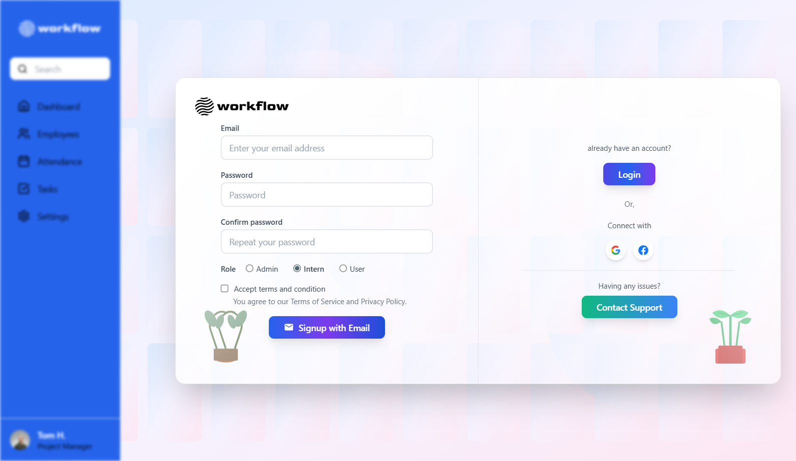
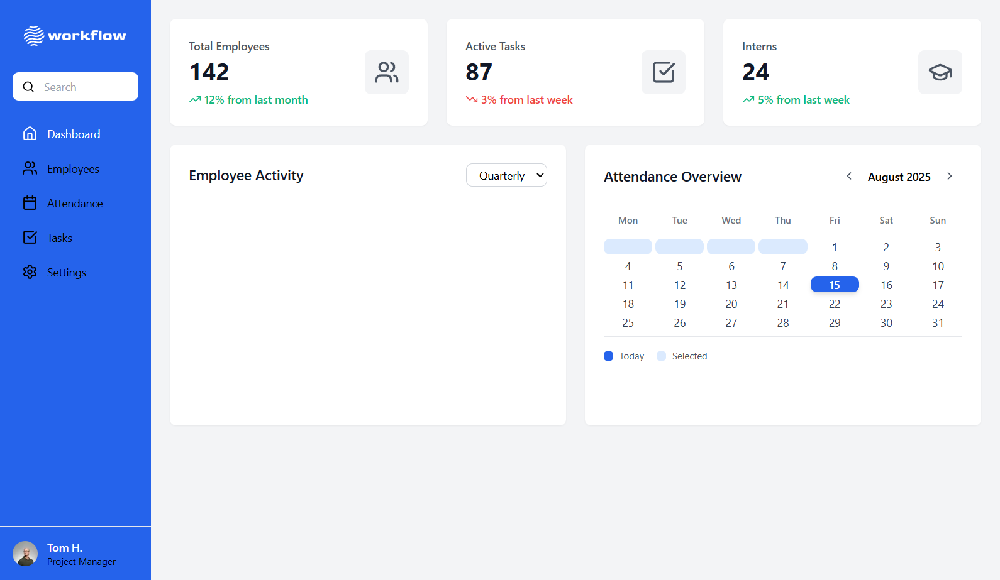

# 🌟 Workflow - Employee Management System

<div align="center">


**A modern, responsive employee management system built with React and TailwindCSS**

[🚀 Live Demo][https://workflow-henna.vercel.app/](https://workflow-henna.vercel.app/)

[](https://reactjs.org/)
[](https://vitejs.dev/)
[](https://tailwindcss.com/)


</div>


## ✨ Features

### 🔐 **Authentication System**
- **Modern Login/Signup Interface** with beautiful gradient backgrounds
- **Role-based Access Control** (Admin, Intern, User)
- **Seamless Card Switching** between signin and signup
- **Form Validation** with real-time feedback
- **Terms & Conditions** acceptance workflow

### 👥 **Employee Management**
- **Complete CRUD Operations** for employee records
- **Advanced Search & Filter** functionality
- **Role-based Permissions** system
- **Employee Profile Management**
- **Bulk Operations** support

### 📊 **Dashboard & Analytics**
- **Interactive Dashboard** with key metrics
- **Real-time Statistics** display
- **Visual Charts** and graphs
- **Performance Tracking**
- **Activity Logs**

### 🎨 **Modern UI/UX**
- **Glassmorphism Design** with backdrop blur effects
- **Gradient Backgrounds** and animations
- **Responsive Layout** for all devices
- **Smooth Transitions** and hover effects
- **Professional Branding** with custom logo

### 🔧 **Technical Features**
- **React Router** for seamless navigation
- **Component-based Architecture**
- **State Management** with React hooks
- **Modern ES6+ JavaScript**
- **CSS Grid & Flexbox** layouts

---

## 🚀 Demo

```bash
# Clone the repository
git clone https://github.com/Ubed-pathan/workflow.git

# Navigate to project directory
cd workflow

# Install dependencies
npm install

# Start development server
npm run dev
```

**Live URL:** `http://localhost:5173`

---

## 🛠️ Installation

### Prerequisites
- Node.js (v16.0 or higher)
- npm or yarn package manager
- Modern web browser

### Quick Start

```bash
# 1. Clone the repository
git clone https://github.com/Ubed-pathan/workflow.git
cd workflow

# 2. Install dependencies
npm install

# 3. Start development server
npm run dev

# 4. Open browser and navigate to
# http://localhost:5173
```

### Build for Production

```bash
# Build optimized production bundle
npm run build

# Preview production build
npm run preview
```

---

## 💻 Usage

### 🔑 **Authentication Flow**

1. **Landing Page**: Beautiful gradient authentication interface
2. **Signup Process**: 
   - Fill email, password, confirm password
   - Select role (Admin/Intern/User)
   - Accept terms and conditions
   - Automatic redirect to signin
3. **Login Process**:
   - Enter credentials and role
   - Access dashboard based on permissions

### 🎯 **Dashboard Navigation**

- **Dashboard**: Overview and key metrics
- **Employees**: Manage employee records
- **Attendance**: Track attendance data
- **Tasks**: Task management system
- **Settings**: Application configuration

### 👤 **User Roles**

| Role | Permissions |
|------|-------------|
| **Admin** | Full system access, user management |
| **Intern** | Limited access, view-only permissions |
| **User** | Standard employee access |

---

## 🎨 Screenshots

### 🌈 Authentication Interface


*Beautiful gradient authentication interface with signup and signin cards*

### 📊 Dashboard Layout


*Modern dashboard with sidebar navigation and analytics cards*

---

## 🏗️ Project Structure

```
workflow/
├── 📁 public/                 # Static assets
├── 📁 src/
│   ├── 📁 components/         # Reusable UI components
│   │   ├── 🔐 AuthLayout.jsx  # Authentication container
│   │   ├── 📝 SigninCard.jsx  # Login form component
│   │   ├── 📝 SignupCard.jsx  # Registration form
│   │   └── 🗂️ Sidebar.jsx     # Navigation sidebar
│   ├── 📁 pages/              # Page components
│   │   ├── 📊 Dashboard.jsx   # Main dashboard
│   │   └── 👥 Employees.jsx   # Employee management
│   ├── 🎨 index.css          # Global styles
│   └── ⚡ main.jsx           # Application entry point
├── ⚙️ vite.config.js          # Vite configuration
├── 🎨 tailwind.config.js      # TailwindCSS config
├── 📦 package.json           # Dependencies
└── 📖 README.md             # Project documentation
```

---

## 🔧 Technologies Used

### Frontend Framework
- **⚛️ React 18** - Modern UI library with hooks
- **⚡ Vite** - Lightning fast build tool
- **🛣️ React Router** - Client-side routing

### Styling & Design
- **🎨 TailwindCSS** - Utility-first CSS framework
- **✨ Custom Gradients** - Beautiful visual effects
- **🌟 Glassmorphism** - Modern design patterns

### Development Tools
- **📦 npm** - Package management
- **🔧 PostCSS** - CSS processing
- **📱 Responsive Design** - Mobile-first approach

### Icons & Assets
- **🎯 Lucide React** - Beautiful icon library
- **🖼️ Custom SVG Graphics** - Professional branding

---

## 🎯 Key Highlights

### 🚀 **Performance Optimized**
- Fast loading with Vite build system
- Component-based architecture
- Efficient state management
- Optimized bundle size

### 🎨 **Modern Design System**
- Beautiful gradient backgrounds
- Smooth animations and transitions
- Professional color palette
- Consistent spacing and typography

### 📱 **Responsive Excellence**
- Mobile-first design approach
- Flexible grid layouts
- Touch-friendly interactions
- Cross-browser compatibility

### 🔐 **Security Features**
- Form validation and sanitization
- Role-based access control
- Secure authentication flow
- Input validation

---

---

## 🔐 Authentication System

### Features
- ✅ **Dual-mode Interface** - Signup and Signin in one view
- ✅ **Role Selection** - Admin, Intern, User roles
- ✅ **Form Validation** - Real-time validation feedback
- ✅ **Seamless Switching** - Toggle between signup/signin
- ✅ **Professional UX** - Smooth transitions and feedback

### Security
- 🔒 Password confirmation validation
- 🔒 Terms acceptance requirement
- 🔒 Role-based access control
- 🔒 Form sanitization

---

## 🚀 Getting Started

### For Developers

```bash
# 1. Fork the repository
# 2. Clone your fork
git clone https://github.com/YOUR_USERNAME/workflow.git

# 3. Create a feature branch
git checkout -b feature/amazing-feature

# 4. Install dependencies
npm install

# 5. Start development
npm run dev

# 6. Make your changes and commit
git commit -m "Add amazing feature"

# 7. Push to your branch
git push origin feature/amazing-feature

# 8. Open a Pull Request
```

### For HR and Reviewers

This project demonstrates:
- ✅ **Modern React Development** practices
- ✅ **Responsive Web Design** principles
- ✅ **Clean Code Architecture**
- ✅ **Professional UI/UX Design**
- ✅ **Version Control** with Git
- ✅ **Documentation** and project organization

---

## 🤝 Contributing

Contributions are welcome! Please feel free to submit a Pull Request.

### Development Guidelines
1. Follow the existing code style
2. Write meaningful commit messages
3. Test your changes thoroughly
4. Update documentation as needed

---


---

## 👤 Author

**Ubed Pathan**
- 📧 Email: ubedpathan818@gmail.com
- 🐙 GitHub: [@Ubed-pathan](https://github.com/Ubed-pathan)
- 💼 LinkedIn: https://www.linkedin.com/in/ubed-pathan-35a715242
- 🌐 Portfolio: https://ubed.tech/

---

<div align="center">

### 🌟 **Thank you for reviewing this project!** 🌟

**Made with ❤️ using React and TailwindCSS**

[](https://github.com/Ubed-pathan/workflow)

</div>